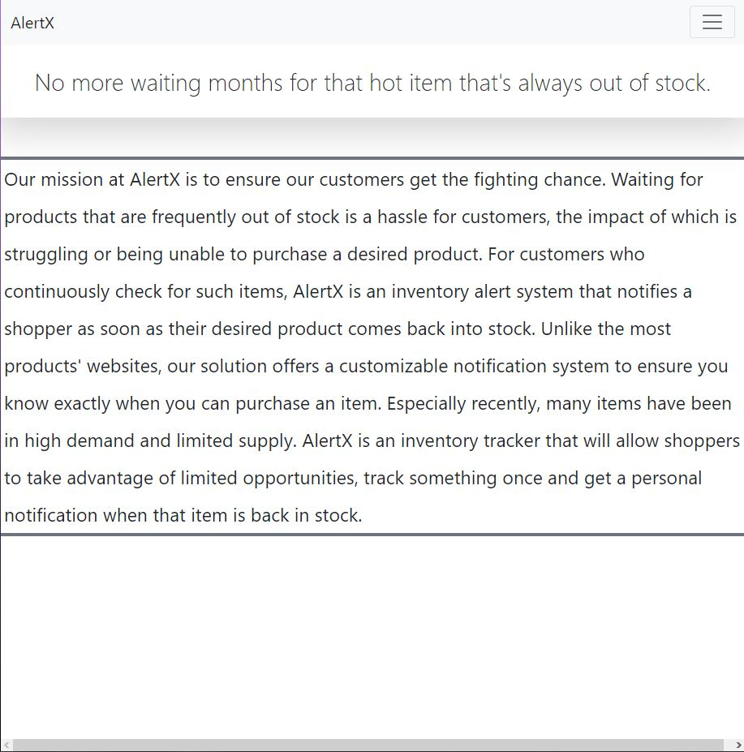
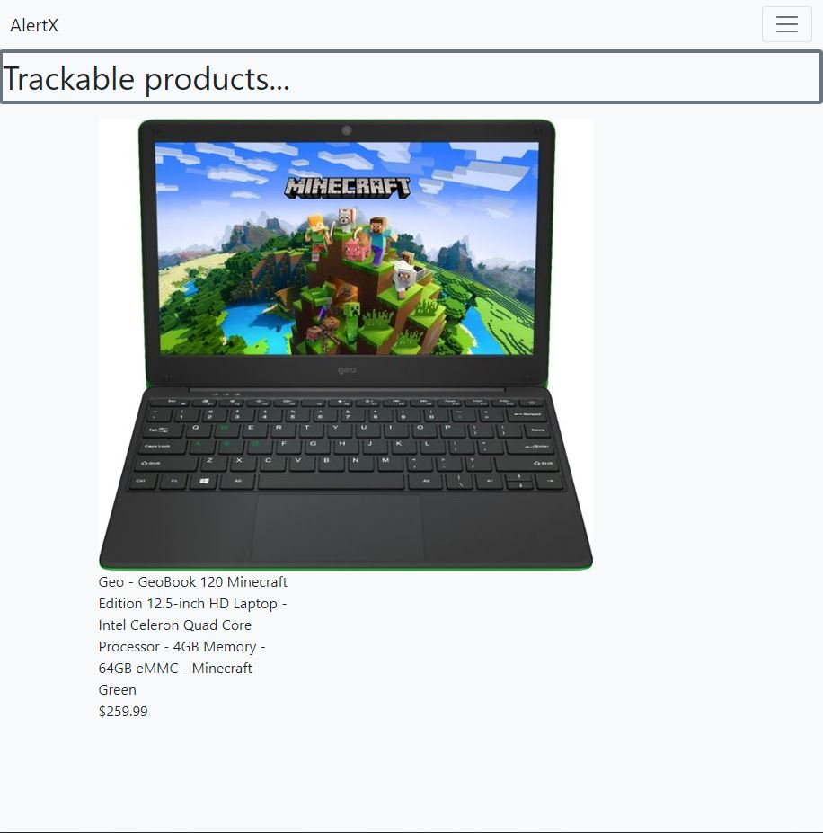

# D.4 Implementation 1

## 1. Introduction

Designed for customers who continuously check for out of stock items, AlertX is an inventory alert system that notifies a shopper as soon as their desired product comes back into stock. Our solution offers a customizable notification system to ensure you know exactly when you can purchase an item, unlike most product's websites. With a clean and functioning interface, our user will successfully recieve gathered information about products and their stock status quickly so that they can worry less about a certain item being sold-out again. The search bar allows the user to search and select for products they desire to be notified about. After product selection, there is a customizeable notification page. Here there is a SMS or email option, where the user can select their preference and even choose both options. Our product uses a Database; within this Database, basic user information is documented to help notify the user of their product via notification. The central requirement of our system is that restock notifications are accurate and up to date with the current market. Users have acces to their own search history where they can view everything they track. With items in high demand and limited supply, we offer a fighting chance to consumers. AlertX is an inventory tracker that allows shoppers to avoid the wait, track it once and get a personal notification when that item is back in store.

## 2. Implemented requirements

* Requirement: _As a consumer, I want to be able to search for all products that are available to track._
* Issue: https://github.com/colinvwood/AlertX/issues/89
* Pull request: https://github.com/colinvwood/AlertX/pull/91
* Implemented by: Colin Wood
* Approved by: Georgia Buchanan and Kameron Dailey
* Print screen: 
  * 
  * 

## 3. Adopted technologies

**List the adopted technologies with a brief description and justification for choosing them.**

* Node.js - Our main backend technology. Node interprets our backend javascript and continuously serves our website by integrating with Express.
* Express - Our route handler. We use Express to statically serve our website directory structure as it is hosted on our server.
* Bootstrap - Our CSS and javascript library. We use Bootstrap components to create the client-side layout and styling of our website.

## 4. Learning/training

Our team's primary learning strategy has been to research and assign in to each group members according to interests and availability during a weekly cyle. Our original idea was to use Best Buy's API that implemented technologies like Bootstrap, Node.js, and VS Code. However, we then discovered that Best Buy's API may not be available, so we decided to go with Newegg's API that implements Java SDK and possibly web-scrape that implements Python. We discovered in our project that Java SDK could be difficult for everyone to learn and web-scraping could be easier as it implements Python. 

For any given topic, most of our members research independently, then educate the rest of the group on what we have learned either during meetings or on Discord. Since some people had prior knowledge, we were able to cover some topics early on during our weekly meetings and setup the framework, Bootsrap, and hosted a website. Throughout the semester, we have used Discord as a source for posting resources and keeping everyone up to date. During this time, in-person meetings are not possible, but we have effectively used Discord to screen-share and communicate and Trello to keep us all busy with tasks and develop productively. As the web application continues to develop, we hope this cycle of learning, sharing, and modification continues. 

## 5. Deployment

We are hosting our website on one of our member's virtual private servers. The site is reachable at: www.colinwood.dev/alertx. We are using Node.js as the backend framework and Express to handle routing. For local development, we simply open the .html files directly in our own browsers using the file:/// protocol.

## 6. Licensing

This project has adopted the MIT Licences for its general use and flexibility. This allows us to use our code in a buisness capacity and for commercial purposes as we see fit. Other people may use our code as well, so long as they credit us as the original author; If others decide to use our code or software, we can not be held liable under the MIT license, which for our purposes, is a benefit. Right now, the MIT license will suit our needs appropiately, it is incredibly permissive but also supplies the perfect amount of protection.

## 7. Readme File
Besides the Readme.md file, your repository should contain a CONTRIBUTING.md 
file, a LICENSE file, and a CODE_OF_CONDUCT.md file. Search online for some 
examples of these files. In this section of the deliverable, put links to these files on GitHub.

-[Readme.md](https://github.com/colinvwood/AlertX/blob/main/README.md)

-[Code of Conduct](https://github.com/colinvwood/AlertX/blob/main/CODE_OF_CONDUCT.md)

-[License](https://github.com/colinvwood/AlertX/blob/main/LICENSE)

-[Contributing](https://github.com/colinvwood/AlertX/blob/main/LICENSE)

## 8. Look & feel

We desired a clean interface that takes you directly to viewable products. The simple design showcases our value propsition as well as what the website's purpose is.

As for the product pages we choose one to showcase for layout purposes.

This simplistic design gets our purpose across most of all, however, moving forward the page will become more complex. We intend to add more color to ensure our website does feel too standard.

## 9. Lessons learned

Our team's initial development cycle went okay. Actual implementation of the website took more time than expected, and would have been a good idea to start on that even earlier. Our MVP is truly minimal as a result. From this development cycle, we have all gained a lot of information regarding how this application will continue to proceed with development. Each team member still feels they need to do a bit more research on what technologies are being used so that when issues occur it will be a faster and easier process to solve. We are getting more comfortable with git and github each day, moving forward this team plans to continue to communicate and interact substantially regarding this product.

## 10.Demo

Link to a video showing the system working: 
