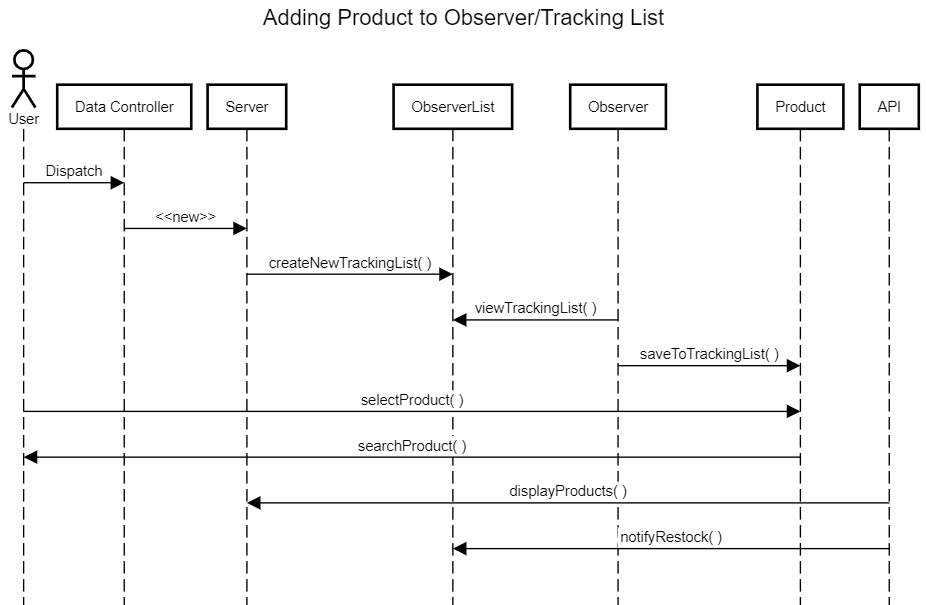

# D.5 Design 

Grading: 30 points
In this deliverable, you should describe the architectural design of your system. Structure your
deliverable using the following sections. See the “Team Project Instructions” for details about
formatting. Check the lecture materials and perform additional research to produce a highquality deliverable. As usual, if you have any questions, let me know.

## 1. Description
Provide 1-2 paragraphs to describe your system. This will help understand the context of
your design decisions. You can reuse and update text from the previous deliverables.

Grading: 2 points. Criteria: Completeness (1 pt); Consistency with the rest of the document
(0.5 pt); Language (0.5 pt).

## 2. Architecture

There are 2 primary modules that are utilized for our website. The website module manages two other packages for requests and responses. The lines represent dependency on one class for another. The dotted lines represent access between classes as well as dependency. Each of the classes serves in response to the request even if not directly. This format can later be scaled up to include more APIs to search from.

## 3. Class diagram

## 4. Sequence diagram

## 5. Design Patterns
Split this section into 2 subsections. For each subsection, present a UML class diagrams
showing the application of a design pattern to your system (a different pattern for each
section). Each class diagram should contain only the classes involved in the specific pattern
(you don’t need to represent the whole system). Choose patterns from two different
categories: Behavioral, Structural, and Creational. You are not limited to design patterns
studied in class.

Your system may not appropriate for any design pattern. In this case, for didactic purpose, be
creative and extend a little bit the scope of your system to make the design patterns
appropriate.

Implement each design pattern in your system and provide GitHub links to the
corresponding classes. Example (the links are just illustrative):

Car: https://github.com/user/repo/blob/master/src/com/proj/main/Car.java

IBreakBehavior: https://github.com/user/repo/blob/master/src/com/proj/main/IBreakBehavior.java

BrakeWithABS: https://github.com/user/repo/blob/master/src/com/proj/main/BrakeWithABS.java

Brake: https://github.com/user/repo/blob/master/src/com/proj/main/Brake.java

Grading: 6 points (3 pts each pattern). Criteria: Correct use of the design pattern as described
in the literature (1.5 pt); Adequate choice of the design pattern (0.5 pt); Adequate
implementation of the design pattern (1 pt).

## 6. Design Principles
How does your design observe the SOLID principles? Provide a short description of followed
principles giving concrete examples from your classes.

Our source code doesn't strictly implement many object-oriented programming techniques due to the web-app status of our project and the fact that only a groundwork amount of coding in a full-fledged programming language (javascript) has been done. However, other aspects of the structure of our project do adhere to the SOLID principles. 
* Our directory structure demonstrates the *single responsibility principle*: the routes directory deals with the logic of routing requests to our site, the views directory stores the webpages that are visible to the client, our stylesheets directory stores all the css, and so on--each has only its one responsibility.
* By using Express on top of Node.js as the main backend frameworks we've adhered somewhat to the *open-closed principle*: instead of using a simpler webserver (such as the http-server that ships with Node) or coding our own, either of which would have been more error-prone, we invested upfront in learning and using these technologies which are extensible but which we do not need to modify.
* When users visit our site and they want to search for an item to track, they may want to either scroll through options or be able to search directly (via a text search interface). By seprating the search interface from the catalogue (scrolling) interface, we will implement the *interface segregation principle*.

Grading: 6 points. Criteria: Show correct understanding of SOLID principles (3 pts); Provide
enough details to justify how the principles were observed (3 pts).
