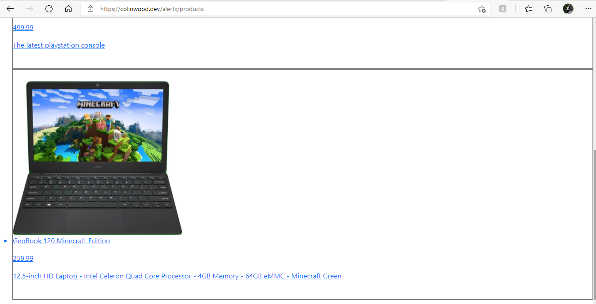
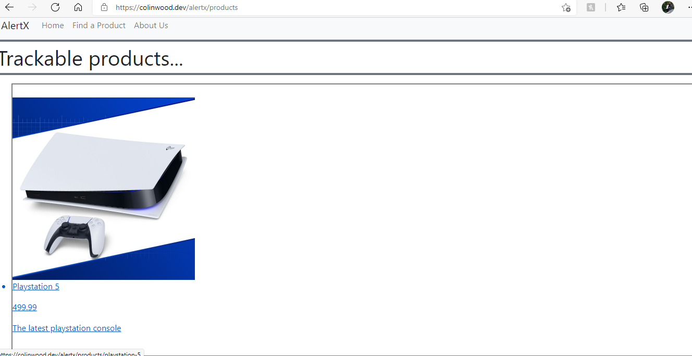
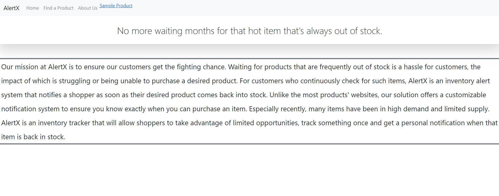
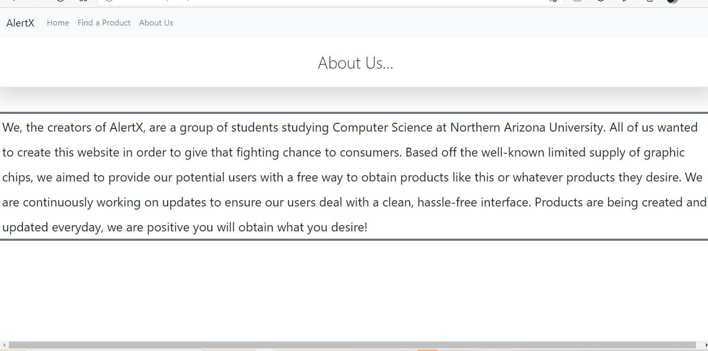
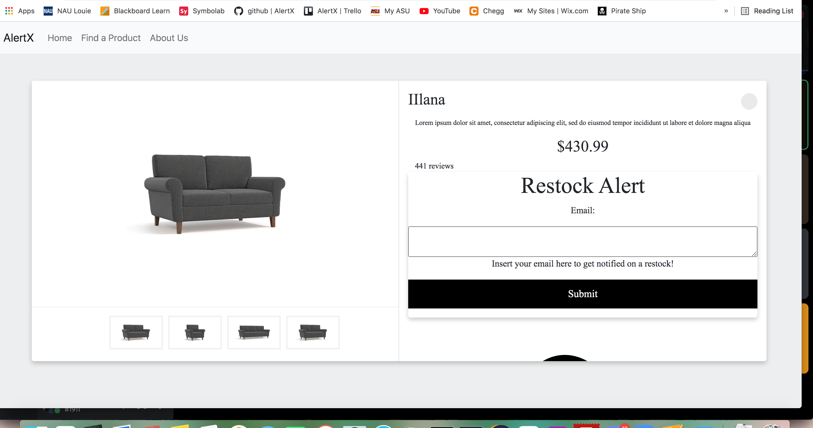
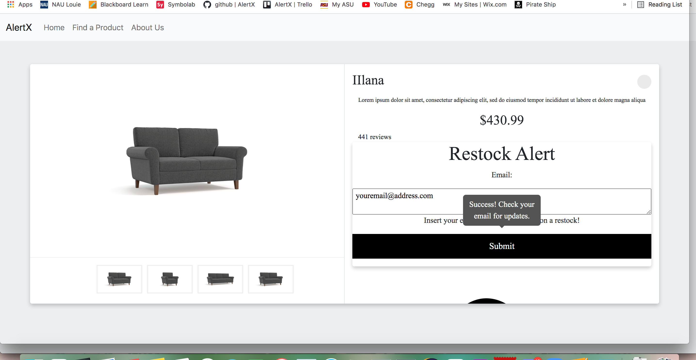

# D6 Implementation 2 

## 1. Introduction 

Designed for customers who continuously check for out of stock items, AlertX is an inventory alert system that notifies a shopper as soon as their desired product comes back into stock. Our solution offers a customizable notification system to ensure you know exactly when you can purchase an item, unlike most product's websites. With a clean and functioning interface, our user will successfully receive gathered information about products and their stock status quickly so that they can worry less about a certain item being sold-out again. 

Our system will be kept relatively simple and straight forward. Through our web interface, the customer will be able to browse products that they would like to be selected to be notified for. After product selection, there is a notification option. Here there is a SMS or email option, where the user can select their preference and even choose both options. Our product uses a Database; within this Database, basic user information is documented to help notify the user of their product via notification. The central requirement of our system is that restock notifications are accurate and up to date with the current market. Users have access to their own search history where they can view everything they track. Depending on which is selected, the client’s information and the product they selected will be stored in our database. When the time comes that the product they selected is back in stock, we can pull their information from our data base and send them their specified notification. With items in high demand and limited supply, we offer a fighting chance to consumers. AlertX is an inventory tracker that allows shoppers to avoid the wait, track it once and get a personal notification when that item is back in store.

## 2. Implemented requirements
List in this section, the requirements and associated pull request that you implemented for
this release, following the example below---include the description of the requirement,
link to the issue, link to the pull request(s) that implement the requirement, who
implemented the requirement, who approved it, and a print screen that depicts the
implemented feature (if applicable). Order the requirements by the name of the student
who implemented it.

###1.
* Requirement: _As a consumer, I want to be able to view products available to track._
* Issue: https://github.com/colinvwood/AlertX/issues/89
* Pull request: https://github.com/colinvwood/AlertX/pull/91
* Implemented by: Colin Wood
* Approved by: Georgia Buchanan and Kameron Dailey
* Implementation time: 1 day
* Print screen: The user is able to view products that are available to be tracked.
  * 
  * 

###2.
* Requirement: _As a consumer, I want to be able to navigate this site easily._
* Issue: https://github.com/colinvwood/AlertX/issues/129 or https://trello.com/c/RksbiNXT/75-keep-it-simple-and-user-friendly
* Pull request: https://github.com/colinvwood/AlertX/pull/127
* Implemented by: Georgia Buchanan
* Approved by: Jenna Pedro 
* Implementation time: 4 hours
* Print screen: This screen shot shows we are trying to keep our site simple with three main tabs and a small description for the Home and About Us page.
  * 

###3.
* Requirement: _As a consumer, I want to be able to learn more about the developers._
* Issue: https://github.com/colinvwood/AlertX/issues/129
* Pull request: https://github.com/colinvwood/AlertX/pull/127
* Implemented by: Georgia Buchanan
* Approved by: Jenna Pedro
* Implementation time: 4 and 1/2 hours
* Print screen: The user, is able to click on the "About Us" tab to learn more about the developers.
  * 

##4.
* Requirement: _As a consumer, I want to be able to sign up for email notifications._
* Issue: https:https://github.com/colinvwood/AlertX/issues/126 or https://trello.com/c/6MrbqfLb/56-retrieve-email-and-add-to-database-show-success-to-user
* Pull request: https://github.com/colinvwood/AlertX/pull/134
* Implemented by: Jenna Pedro
* Approved by: Georgia Buchanan 
* Implementation time: 5 and 1/2 hours
* Print screen: The user is able to enter an email so they can receive a notification.
  * 

##5.
* Requirement: _As a consumer, I want to be to know when I have successfully signed up for notifications._
* Issue: https://github.com/colinvwood/AlertX/issues/135 or https://trello.com/c/BmeAHTuR/53-create-email-form-for-client
* Pull request: https://github.com/colinvwood/AlertX/pull/134
* Implemented by: Jenna Pedro
* Approved by: Georgia Buchanan
* Implementation time: 5 hours
* Print screen: You can see the pop-up shows the user they have successfully entered their information.
  * 

##6.
* Requirement: _As a consumer, I want to be able to search for products, their prices, and more information clearly and easily._
* Issue: https://github.com/colinvwood/AlertX/issues/133 or https://trello.com/c/nckvQOeR/76-make-clean-and-easy-to-search
* Pull request: https://github.com/colinvwood/AlertX/pull/134
* Implemented by: Kameron Dailey
* Approved by: Georgia Buchanan
* Implementation time:  1 day and 8 hours
* Print screen: 
  * 

##7.
* Requirement: _As a consumer, I want to be able to search for many items that I could find on a site such as Amazon._
* Issue: https://github.com/colinvwood/AlertX/issues/124 or https://trello.com/c/B4YbSG9K/58-create-refine-product-listing-page-this-page-should-ideally-retrieve-product-data-from-our-api-product-database
* Pull request: https://github.com/colinvwood/AlertX/pull/136
* Implemented by: Kameron Dailey
* Approved by: Georgia Buchanan
* Implementation time: 2 days
* Print screen: This is hard to get a print screen of as this issue dealt with implementing an API that can show multiple products. So, we decided to include two photos that show there is more than one product now on the site.
  * 
  * 

## 3. Demo

Link to video: https://drive.google.com/file/d/1DNZP8G2FktBNyh2pafKpgaahhNG-TqX7/view?usp=sharing

## 4. Code quality
Our code conventions ensure readabiliity and have commonplace amdist all of our implemented features. First and foremost, the EJS files adhere to tab spacing meaning that each tag is separated by tabs in order to show what is held within each tag for clarity. In addition, the code for JavaScript adheres to a clear spacing convention mentioned, but also ensure the brackets are on the same line as the function details. These simple conventions are enough to ensure our code was readable for all other members of the project.

## 5. Lessons learned
In retrospective, describe what your team learned during this second release and what
would you change if you would continue developing the project:

* Learning a new environment is difficult - As a team, we put many hours into this week’s deliverable, the majority of which went into understanding how to implement a new API and working with HTML/Python for sending emails to customers who sign up with a form to get notified on restocks.

* Developing a client-face deliverable is complicated - Our product’s value relies heavily on the backend since we designed it to select what product the user wants a restock email on. Unfortunately, it isn’t very easy to deliver that email until the API actually sends a message, when something is back in stock, to your device from the database. Since our product’s purpose is around client-facing, email/message-communicated deliverables, we spent our time doing research around the API we plan on using and  HTML/Python to at least write the structure of the software. 

* More time to continue developing the project would be great - If our team would continue developing the project, we would probably change our time management with the deliverables and dedicate more time on our website. We had many barriers during the process of making AlertX, so with more time, resources, and research, we could probably make everything better. However, with the time frame we have and putting lots of effort into our deliverables, we were only able to do the minimum. 
