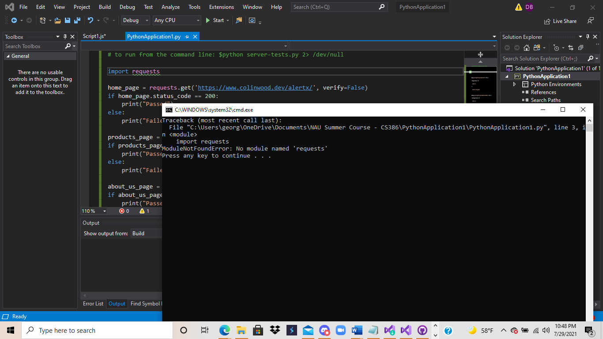

# D7 Verification & Validation

## 1. Description

Designed for customers who continuously check for out of stock items, AlertX is an inventory alert system that notifies a shopper as soon as their desired product comes back into stock. Our solution offers a customizable notification system to ensure you know exactly when you can purchase an item, unlike most product's websites. With a clean and functioning interface, our user will successfully receive gathered information about products and their stock status quickly so that they can worry less about a certain item being sold-out again.

Our system will be kept relatively simple and straight forward. Through our web interface, the customer will be able to browse products that they would like to be selected to be notified for. After product selection, there is a notification option. Here there is a SMS or email option, where the user can select their preference and even choose both options. Our product uses a Database; within this Database, basic user information is documented to help notify the user of their product via notification. The central requirement of our system is that restock notifications are accurate and up to date with the current market. Users have access to their own search history where they can view everything they track. Depending on which is selected, the client’s information and the product they selected will be stored in our database. When the time comes that the product they selected is back in stock, we can pull their information from our data base and send them their specified notification. With items in high demand and limited supply, we offer a fighting chance to consumers. AlertX is an inventory tracker that allows shoppers to avoid the wait, track it once and get a personal notification when that item is back in store.

[Project Repository](https://github.com/colinvwood/AlertX)  
[Trello](https://trello.com/b/Y4P9ZZVL/alertx) 

## 2. Verification (tests)

### 2.1. Unit test

* 2.1.1. 
We used mocha, chai, node.js's built-in assert module, and supertest.

* 2.1.2. Link to your GitHub folder where your automated unit tests are located.
https://github.com/colinvwood/AlertX/tree/main/site/test

* 2.1.3. 
https://github.com/colinvwood/AlertX/blob/main/site/test/sampleproduct-test.js

* 2.1.4. A print screen for the testing could not be provided as there were issues to what it could access at the time of running the tests.

### 2.2. Integration test
When designing our system, we intended to incorporate an automated emailing service to enhance our product. This task alone created issues as it required compatibility with our other API system for locating products. Due to time constraint and restrictions faced with third party services we were not able to fully implement this feature. This in turn hindered us from producing a full integration test.

* 2.2.1. 
We used the python requests library to send http requests to our serrver and make sure success responses were returned.

* 2.2.2. 
https://github.com/colinvwood/AlertX/tree/main/site/test 

* 2.2.3. 
https://github.com/colinvwood/AlertX/blob/main/site/test/server-tests.py

* 2.2.4. No print screen available again, sorry!

### 2.3. Acceptance

As mentioned above in 2.2, we had issues fully developing an automated emailing service. This caused errors for us when creating an Acceptance test, as we did not have an automatic emailing service, however we were still able to produce a demo version of how the system would run through the eyes of the user.

* 2.3.1. When testing our system, we would use Selenium as it allows for testing of web application across many different browsers and platforms. 
* 2.3.2. Due to time constraints we were not able to fully implement an acceptance test. However the link, links the folder where our test our stored(finished and unfinished).
* 2.3.3. When creating our acceptance test we would follow the format similar to our unit test, however it would be from the perspective of the user (blackbox) and using more than a single unit test in conjuncture.
* 2.3.4. Due to the restrictions mentioned above, we were not able to produce a print screen, however we were able to produce a demo to show the system running from the user's perspective.

## 3. Validation (user evaluation)

### Script

1. What do you think about how the webpage looks?
2. Is it easy to locate what you are looking for on the webpage?
3. What was difficult about it?
4. When filling out the email form, was it easy to fill out?
5. How would you rate the overall ease of use (1 to 10)
6. What could be improved?
7. Would you use it currently, or wait for it to be developed more? Why or why not?
8. What would be the overall score 1-10?
9. Why did you give it this score?
10. Is there anything you would like to add if you were a shopper trying to get notified about a restock? 

### Results

**1st User: Rhianna Pedro**

**1. What do you think about how the webpage looks?**
* Plain. Everything is white, needs color or some pictures. 

**2. Is it easy to locate what you are looking for on the webpage?**
* Yes, it easily says what to navigate 

**3. What was difficult about it?**
* Nothing

**4. When filling out the email form, was it easy to fill out?**
* Yes super easy, because I just needed to put the email and it told me to check my email afterwards.

**5. How would you rate the overall ease of use (1 to 10)**
* 10

**6. What could be improved?**
* The overall look of the website

**7. Would you use it currently, or wait for it to be developed more? Why or why not?**
* Wait for it to be more developed because you want to see more products and have it be more appealing. 

**8. What would be the overall score 1-10?**
* 8.5

**9. Why did you give it this score?**
* Because of how the website looks kind of plain

**10. Is there anything you would like to add if you were a shopper trying to get notified about a restock?**
* Just more product options and reviews. 

**2nd User: Kolin Galdiano**

**1. What do you think about how the webpage looks?**
* Simple, because it is very plain with very few texts and no images. 

**2. Is it easy to locate what you are looking for on the webpage?**
* Yes, since there are tabs on the top of the page

**3. What was difficult about it?**
* Nothing since it is prettty simple

**4. When filling out the email form, was it easy to fill out?**
* Yes, because since it is only a 1 step process then I can get notified. 

**5. How would you rate the overall ease of use (1 to 10)**
* 10, super easy to use

**6. What could be improved?**
* Add more products and add more to the webpage. 

**7. Would you use it currently, or wait for it to be developed more? Why or why not?**
* Wait for it to be more developed so that there could be products and bigger reputation of people using the program.

**8. What would be the overall score 1-10?**
* 8

**9. Why did you give it this score?**
* Because it looks unfinished 

**10. Is there anything you would like to add if you were a shopper trying to get notified about a restock?**
* Have reviews from customers on the homepage about our website saying, “AlertX was able to get me an exclusive graphics card, which is usually hard to get!” Maybe being able to create a profile to see the items that I have saved for a restock would be nice. 

**3rd User: Joseph Gandy**

**1. What do you think about how the webpage looks?**
* Quite simple and to the point, I feel like that is easy to update the aesthetic though. 

**2. Is it easy to locate what you are looking for on the webpage?**
* Yes, not too many tabs or details that feel overwhelming

**3. What was difficult about it?**
* Honestly nothing, I can find everything quite easily.

**4. When filling out the email form, was it easy to fill out?**
* Yes, it requires one step and I received a submission email showing I am now tracking that product. 

**5. How would you rate the overall ease of use (1 to 10)**
* 10, nothing hard about it to use.

**6. What could be improved?**
* Add more products that can be tracked and work on the aesthetic of the webpage. 

**7. Would you use it currently, or wait for it to be developed more? Why or why not?**
* I work a lot with 3D printing and need to reorder materials quite often, I would definitely use this once products that supply that kind of printer are added.

**8. What would be the overall score 1-10?**
* 6, it is to the point but I think a lot more can be done regarding how many products are available to track and the look and feel of the site.

**9. Why did you give it this score?**
* Again, a lot more can be done especially revolving the way the site looks. It does the job well, but you could entice a lot more users with a really cool design. 

**10. Is there anything you would like to add if you were a shopper trying to get notified about a restock?**
* Include reviews from other users and apart from that it seems like a great app.

### Reflections
**User: Rhianna Pedro**

The feedback from Rhianna, we realized that we needed a much more appealing design to our website. Her initial thoughts on the website were mostly about appearance. The more she looked at it, the more she kept talking about wanting more color and pictures. We didn't have much time to fully make the website look appealing or nice, and that's what she noticed as well. 

**User: Kolin Galidiano**

Kolin's feedback focused on the appearance of the website and functionality. He also noticed that the website looked plain but he liked the simplicty of the webpage and how it was easy to navigate everything. However, he did make some suggestions about what we could add to our webpage. He said that we could add more products and some reviews to the home page about customers liking our application so that people are more attracted to our services. He also suggested a "Profile" page for users to save the items they want restock notifications on. Kolin really looks forward to AlertX being more developed and having a bigger reputation.

**User: Joseph Gandy**

Joseph's feedback focused on the product availability and appearance of the site. His initial thoughts were along the lines of whether or not an application such as AlertX is actually useful to shoppers as most sites let them know the availability anyway. His interest peaked when I mentioned this app is designed to take away the shopper ever having to look at the availability in the first place. Joseph uses 3D printing as a hobby, he explained it is a fiddle machine which means he buys a lot more materials than he actually ends up using. An app that gives Joseph a chance to purchase materials with doing less work is something he explained his interest in. However, with more products implemented, such as materials for 3D printing, he sees himself using this app and suggesting it to friends with the same kind of hobbies. His last suggestions were about the look of the site. Although he mentioned it gets to the point and there is not any bad or harmful aspects, working on a cooler aesthetic for the site will attract more people.
